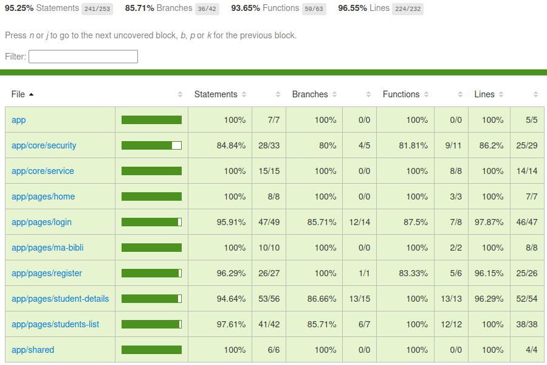
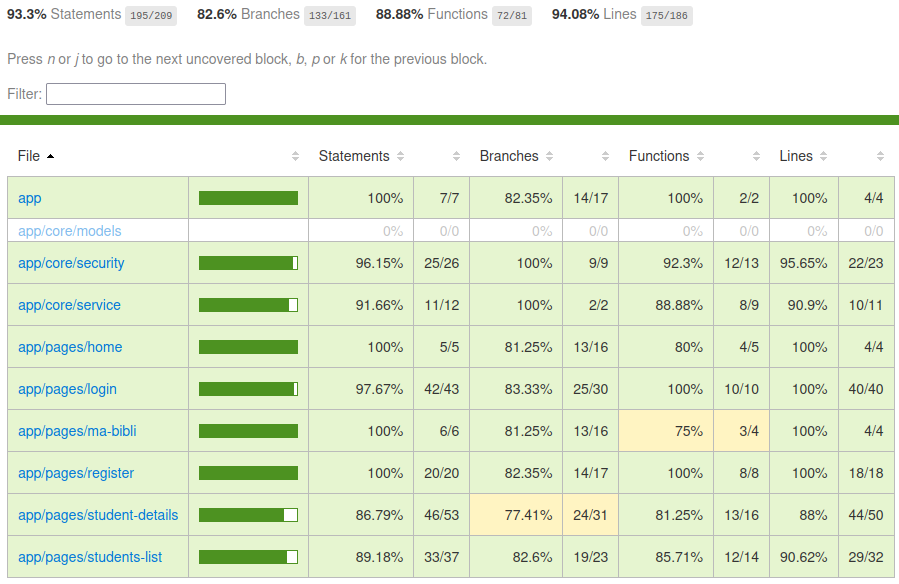

# Plan de tests QA Frontend

## 1) Objectif

Ce document décrit la stratégie de tests frontend pour l'application Angular **EtuBibliothèque** :

- **tests unitaires / intégration légère** : composants, services, sécurité (guard, interceptor) ;
- **tests E2E** : parcours utilisateur via Cypress avec API mockée.

## 2) Périmètre (Scope)

### Inclus

- Composants UI Angular :
  - rendu minimal attendu,
  - interactions utilisateur (clic, submit, reset),
  - gestion d'état d'interface (`loading`, `errorMessage`, `successMessage`, mode édition/création),
  - comportements `Input` / `Output` (ex. `StudentDetailsComponent`).
- Services frontend :
  - logique métier frontend,
  - appels HTTP (mockés),
  - émission d'événements/notifications (ex. `studentChanged$`),
  - gestion session/authentification côté client (`localStorage`, expiration token).
- Sécurité frontend :
  - `AuthGuard` (protection des routes),
  - `AuthInterceptor` (en-tête `Authorization: Bearer …`).
- Intégration légère composant-service via mocks/stubs.
- **Tests E2E Cypress** : navigation, formulaires, garde d'authentification, CRUD étudiant, parcours bout-en-bout (API interceptée, pas de backend réel).

### Exclu

- Tests backend (controllers, persistence, sécurité serveur).
- Intégration complète avec serveur réel.
- Tests de performance frontend, charge, sécurité dynamique.
- Tests visuels pixel-perfect.

## 3) État d'implémentation (snapshot)

| Catégorie | Fichiers / cibles | Tests | Statut |
| --- | --- | --- | --- |
| Composants | `AppComponent`, `HomeComponent`, `LoginComponent`, `RegisterComponent`, `MaBibliComponent`, `StudentsListComponent`, `StudentDetailsComponent` | 52 | ✅ Implémenté |
| Services | `UserService`, `AuthService` | 21 | ✅ Implémenté |
| Sécurité | `authGuard`, `authInterceptor` | 3 | ✅ Implémenté (smoke + interceptor) |
| E2E Cypress | 7 fichiers dans `cypress/e2e/` | 37 | ✅ Implémenté |
| **Total unitaires** | 11 suites `*.spec.ts` | **76** | ✅ Tous passants |
| **Couverture Jest** | lignes / statements | **97,0 % / 97,3 %** | ✅ Objectif ≥ 80 % atteint |
| **Couverture Cypress E2E** | lignes / branches | **94,1 % / 82,6 %** | ✅ Objectif ≥ 80 % atteint |

Commandes de vérification :

```bash
npm test                  # unitaires + couverture Jest (rapport HTML dans coverage/)
npm run e2e:ci            # E2E headless (serveur Angular démarré automatiquement)
npm run e2e:coverage      # E2E + couverture Cypress (rapport dans coverage-e2e/)
npm run test:ci           # pipeline complet (CI)
```

## 4) Types de tests concernés

### Tests de composants

- **Objectif :** vérifier le comportement visible pour l'utilisateur.
- **Cibles :** `HomeComponent`, `LoginComponent`, `RegisterComponent`, `MaBibliComponent`, `StudentsListComponent`, `StudentDetailsComponent`, `AppComponent`.
- **Exemples :** navigation, validation formulaire, affichage états (`loading` / `error` / `success`), émission d'events.

### Tests de services

- **Objectif :** vérifier la logique frontend et les contrats HTTP.
- **Cibles :** `UserService`, `AuthService`.
- **Exemples :** URL/méthode HTTP, payload, gestion erreurs, émission `Subject`, stockage/lecture session.

### Tests de sécurité (unitaires)

- **Cibles :** `authGuard`, `authInterceptor`.
- **Exemples :** instanciation du guard ; ajout de l'en-tête `Authorization` lorsque `id_token` est présent dans `localStorage`.

### Tests E2E (Cypress)

- **Objectif :** valider les parcours utilisateur dans un navigateur réel, avec `cy.intercept` pour simuler le backend.
- **Fichiers :**

| Fichier | IDs de référence | Thème |
| --- | --- | --- |
| `home.cy.ts` | E2E-HOM-01 → 03 | Accueil, navigation register/login |
| `register.cy.ts` | E2E-REG-01 → 06 | Inscription, validation, erreur 400 |
| `login.cy.ts` | E2E-LOG-01 → 09 | Connexion, returnUrl, déjà connecté |
| `ma-bibli.cy.ts` | E2E-MA-01 → 02 | Page protégée, déconnexion |
| `auth-guard.cy.ts` | E2E-GUA-01 → 04 | Redirections, JWT dans les requêtes |
| `students-list.cy.ts` | E2E-STL-01 → 11 | Liste, CRUD, erreurs API |
| `user-journey.cy.ts` | E2E-FLOW-01 → 02 | Parcours étudiant et admin complets |

- **Commandes utilitaires** (`cypress/support/commands.ts`) : `setAuthSession`, `loginByApi`, `mockStudentsList`, `fillRegisterForm`, `fillLoginForm`.

## 5) Stratégie de test

### Isolation

- Dépendances mockées (services, routeur, APIs HTTP).
- Pas de backend réel en tests (unitaires et E2E).
- DOM simulé via TestBed/Jest (unitaires) ou navigateur Cypress (E2E).
- Horloge contrôlée pour les comportements temporels (ex. redirection après timeout login).

### Approche

- **Composants :** tester les effets observables (rendu/état/navigation/events), éviter les détails d'implémentation interne.
- **Services :** tester la logique pure + les appels HTTP via `HttpTestingController`.
- **E2E :** privilégier les sélecteurs stables (`data-cy`, `formControlName`) et les fixtures (`cypress/fixtures/`).
- **Priorisation :** parcours critiques en premier (authentification, enregistrement, CRUD étudiant, logout).

## 6) Environnement de test

- Framework frontend : **Angular 19**
- Runner unitaire : **Jest 29** + `jest-preset-angular` (config : `jest.config.js`, setup : `setup-jest.ts`)
- Runner E2E : **Cypress 15** (config : `cypress.config.ts`, `baseUrl` : `http://127.0.0.1:4200`)
- Outils Angular test :
  - `TestBed`, `ComponentFixture`,
  - `provideRouter`, `provideHttpClient`, `provideHttpClientTesting`,
  - `HttpTestingController`.
- Mocks : `jest.fn()`, spies Jest, `cy.intercept()`.
- Utilitaires async : `fakeAsync`, `tick` (timers login).

## 7) Données de test

- Jeux de données mockés pour utilisateurs/étudiants :
  - cas valides (payload complet),
  - cas invalides (champs requis manquants),
  - cas limites (id absent, tableaux vides),
  - cas erreurs (HTTP 400/401/404/500, erreur réseau).
- Données auth :
  - token valide (`cypress/fixtures/token.json`),
  - token expiré,
  - absence de token.
- Jeux de réponses API mockées alignées backend :
  - `POST /api/register` : `201`, `400` (DTO invalide), `400` (login déjà existant),
  - `POST /api/login` : `200`, `400` (mot de passe invalide), `400` (DTO incomplet),
  - `POST /api/students` : `201`, `401` (non authentifié), `400` (login étudiant déjà existant),
  - `GET /api/students` : `200`, `401`,
  - `GET /api/students/{id}` : `200`, `400` (id inexistant), `401`,
  - `PUT /api/students/{id}` : `200`, `400` (DTO invalide), `400` (id inexistant), `401`,
  - `DELETE /api/students/{id}` : `204`, `400` (id inexistant), `401`.

## 8) Cas de tests unitaires (table de référence)

Les identifiants `UT-*` sont référencés dans les fichiers `*.spec.ts` (ex. `it('… (UT-CMP-LOG-01)', …)`).

| ID | Type | Cible | Description | Préconditions | Entrées | Action | Résultat attendu |
| --- | --- | --- | --- | --- | --- | --- | --- |
| UT-CMP-APP-01 | Composant | AppComponent | Crée le composant principal | TestBed initialisé | aucune | création composant | composant instancié |
| UT-CMP-HOM-01 | Composant | HomeComponent | Navigation vers register (succès) | router mocké | aucune | `onNavigateToRegister()` | `navigateByUrl('/register')` appelé |
| UT-CMP-HOM-02 | Composant | HomeComponent | Navigation vers login (succès) | router mocké | aucune | `onNavigateToLogin()` | `navigateByUrl('/login')` appelé |
| UT-CMP-LOG-01 | Composant | LoginComponent | Submit valide (succès) | formulaire initialisé, auth mock success | login/password valides | `onSubmit()` | `loading=true`, message succès, navigation vers `returnUrl` ou `/ma-bibli` après délai |
| UT-CMP-LOG-02 | Composant | LoginComponent | Submit invalide | formulaire vide | champs manquants | `onSubmit()` | pas d'appel auth, `loading=false`, `submitted=true` |
| UT-CMP-LOG-03 | Composant | LoginComponent | Erreur authentification | auth mock erreur HTTP | login/password incorrects | `onSubmit()` | `errorMessage` renseigné, pas de navigation, `loading=false` |
| UT-CMP-LOG-04 | Composant | LoginComponent | Utilisateur déjà connecté | `isLoggedIn()` retourne true | `returnUrl` présent/absent | `ngOnInit()` | redirection immédiate vers destination |
| UT-CMP-REG-01 | Composant | RegisterComponent | Submit valide (succès) | formulaire initialisé, service mock success | champs obligatoires valides | `onSubmit()` | `userService.register(...)` appelé, navigation `/login` |
| UT-CMP-REG-02 | Composant | RegisterComponent | Submit invalide | formulaire vide | champs manquants | `onSubmit()` | pas d'appel service, `submitted=true` |
| UT-CMP-REG-03 | Composant | RegisterComponent | Erreur backend `400` register | formulaire valide, service mock `400` | payload invalide (cas représentatif) | `onSubmit()` | pas de navigation, état du formulaire cohérent |
| UT-CMP-REG-04 | Composant | RegisterComponent | Erreur technique register | formulaire valide, service mock `500`/réseau | payload valide | `onSubmit()` | pas de navigation, composant ne crash pas |
| UT-CMP-REG-05 | Composant | RegisterComponent | Reset formulaire | formulaire dirty | aucune | `onReset()` | formulaire vide, `submitted=false` |
| UT-CMP-MAB-01 | Composant | MaBibliComponent | Logout (succès) | auth/router mockés | aucune | `logout()` | `authService.logout()` + navigation `'/'` |
| UT-CMP-STL-01 | Composant | StudentsListComponent | Chargement liste (succès) | service mock getAll success | liste étudiants | `ngOnInit()` / `retrieveStudents()` | `students` alimenté |
| UT-CMP-STL-02 | Composant | StudentsListComponent | Chargement liste non authentifié | service mock erreur `401` | aucune | `retrieveStudents()` | composant reste stable, liste inchangée/non alimentée |
| UT-CMP-STL-03 | Composant | StudentsListComponent | Réception événement create | `students` initialisé | action `{create}` | émission sur `studentChanged$` | étudiant ajouté, sélection activée, mode création fermé |
| UT-CMP-STL-04 | Composant | StudentsListComponent | Réception événement update | `students` contient id cible | action `{update}` | émission sur `studentChanged$` | étudiant remplacé |
| UT-CMP-STL-05 | Composant | StudentsListComponent | Réception événement delete | `students` contient id cible | action `{delete}` | émission sur `studentChanged$` | étudiant supprimé |
| UT-CMP-STL-06 | Composant | StudentsListComponent | Démarrer création | composant initialisé | aucune | `startCreatingStudent()` | `isCreatingStudent=true`, `currentIndex=-1` |
| UT-CMP-STD-01 | Composant | StudentDetailsComponent | Création étudiant valide (succès) | `isCreating=true`, form valide, service create mock success | prénom/nom/login valides | `createStudent()` | create appelé, message succès, form reset, `notifyStudentChanged(create)` |
| UT-CMP-STD-02 | Composant | StudentDetailsComponent | Création non authentifiée | mode création, form valide, service mock `401` | payload valide | `createStudent()` | message d'erreur, pas de notification create |
| UT-CMP-STD-03 | Composant | StudentDetailsComponent | Création login déjà existant | mode création, form valide, service mock `400` | login étudiant existant | `createStudent()` | message d'erreur, pas de notification create |
| UT-CMP-STD-04 | Composant | StudentDetailsComponent | Création invalide | mode création | formulaire invalide | `createStudent()` | aucun appel service |
| UT-CMP-STD-05 | Composant | StudentDetailsComponent | Mise à jour valide (succès) | `currentStudent.id` présent, form valide, update mock success | champs modifiés | `updateStudent()` | update appelé, message succès, `notifyStudentChanged(update)` |
| UT-CMP-STD-06 | Composant | StudentDetailsComponent | Mise à jour non authentifiée | `currentStudent.id` présent, form valide, service mock `401` | payload valide | `updateStudent()` | message d'erreur, pas de notification update |
| UT-CMP-STD-07 | Composant | StudentDetailsComponent | Mise à jour erreur backend `400` | `currentStudent.id` présent, form valide, service mock `400` | id ou payload invalide (cas représentatif) | `updateStudent()` | message d'erreur, pas de notification update |
| UT-CMP-STD-08 | Composant | StudentDetailsComponent | Mise à jour invalide frontend | id absent ou form invalide | données invalides | `updateStudent()` | aucun appel update |
| UT-CMP-STD-09 | Composant | StudentDetailsComponent | Suppression valide (succès) | `currentStudent.id` présent, delete mock success | id existant | `deleteStudent()` | delete appelé, message succès, `notifyStudentChanged(delete)` |
| UT-CMP-STD-10 | Composant | StudentDetailsComponent | Suppression non authentifiée | `currentStudent.id` présent, service mock `401` | id existant | `deleteStudent()` | message d'erreur, pas de notification delete |
| UT-CMP-STD-11 | Composant | StudentDetailsComponent | Suppression erreur backend `400` | `currentStudent.id` présent, service mock `400` | id invalide (cas représentatif) | `deleteStudent()` | message d'erreur, pas de notification delete |
| UT-CMP-STD-12 | Composant | StudentDetailsComponent | Suppression invalide frontend | `currentStudent.id` absent | aucune | `deleteStudent()` | aucun appel delete |
| UT-CMP-STD-13 | Composant | StudentDetailsComponent | Annulation création | `isCreating=true` | aucune | `cancelEdit()` | emit `createCancelled` |
| UT-SVC-USR-01 | Service | UserService | `register()` HTTP succès | HTTP mock actif | payload register valide | appel `register(payload)` | POST `/api/register` avec body conforme |
| UT-SVC-USR-02 | Service | UserService | `register()` erreur `400` propagée | HTTP mock actif | payload invalide (cas représentatif) | appel `register(payload)` | erreur HTTP `400` propagée |
| UT-SVC-USR-03 | Service | UserService | `getAll()` HTTP succès | HTTP mock actif | aucune | appel `getAll()` | GET `/api/students` |
| UT-SVC-USR-04 | Service | UserService | `getAll()` erreur `401` propagée | HTTP mock actif | aucune | appel `getAll()` | erreur HTTP `401` propagée |
| UT-SVC-USR-05 | Service | UserService | `get(id)` HTTP succès | HTTP mock actif | id valide | appel `get(id)` | GET `/api/students/:id` |
| UT-SVC-USR-06 | Service | UserService | `get(id)` erreur `400` propagée | HTTP mock actif | id inconnu (cas représentatif) | appel `get(id)` | erreur HTTP `400` propagée |
| UT-SVC-USR-07 | Service | UserService | `get(id)` erreur `401` propagée | HTTP mock actif | id quelconque | appel `get(id)` | erreur HTTP `401` propagée |
| UT-SVC-USR-08 | Service | UserService | `create()` HTTP succès | HTTP mock actif | payload étudiant valide | appel `create(data)` | POST `/api/students` |
| UT-SVC-USR-09 | Service | UserService | `create()` erreur `400` propagée | HTTP mock actif | payload invalide (cas représentatif) | appel `create(data)` | erreur HTTP `400` propagée |
| UT-SVC-USR-10 | Service | UserService | `create()` erreur `401` propagée | HTTP mock actif | payload valide | appel `create(data)` | erreur HTTP `401` propagée |
| UT-SVC-USR-11 | Service | UserService | `update()` HTTP succès | HTTP mock actif | id + payload valide | appel `update(id,data)` | PUT `/api/students/:id` |
| UT-SVC-USR-12 | Service | UserService | `update()` erreur `400` propagée | HTTP mock actif | id ou payload invalide (cas représentatif) | appel `update(id,data)` | erreur HTTP `400` propagée |
| UT-SVC-USR-13 | Service | UserService | `update()` erreur `401` propagée | HTTP mock actif | id + payload valide | appel `update(id,data)` | erreur HTTP `401` propagée |
| UT-SVC-USR-14 | Service | UserService | `delete()` HTTP succès | HTTP mock actif | id valide | appel `delete(id)` | DELETE `/api/students/:id` |
| UT-SVC-USR-15 | Service | UserService | `delete()` erreur `400` propagée | HTTP mock actif | id inconnu (cas représentatif) | appel `delete(id)` | erreur HTTP `400` propagée |
| UT-SVC-USR-16 | Service | UserService | `delete()` erreur `401` propagée | HTTP mock actif | id quelconque | appel `delete(id)` | erreur HTTP `401` propagée |
| UT-SVC-USR-17 | Service | UserService | notification create (succès) | abonnement `studentChanged$` | action create | `notifyStudentChanged(action)` | émission action create reçue |
| UT-SVC-USR-18 | Service | UserService | notification update (succès) | abonnement `studentChanged$` | action update | `notifyStudentChanged(action)` | émission action update reçue |
| UT-SVC-USR-19 | Service | UserService | notification delete (succès) | abonnement `studentChanged$` | action delete | `notifyStudentChanged(action)` | émission action delete reçue |
| UT-SVC-AUT-01 | Service | AuthService | login succès + session enregistrée | HTTP mock actif, localStorage nettoyé | credentials valides + token mock | appel `login()` | POST `/api/login`, `id_token` + `expires_at` stockés |
| UT-SVC-AUT-02 | Service | AuthService | login mot de passe invalide | HTTP mock actif | credentials invalides | appel `login()` | erreur HTTP `400` propagée, session non stockée |
| UT-SVC-AUT-03 | Service | AuthService | login DTO incomplet | HTTP mock actif | login/password manquants | appel `login()` | erreur HTTP `400` propagée, session non stockée |
| UT-SVC-AUT-04 | Service | AuthService | logout supprime session | localStorage contient token | aucune | `logout()` | clés `id_token` et `expires_at` supprimées |
| UT-SVC-AUT-05 | Service | AuthService | `isLoggedIn` vrai si token non expiré | `expires_at` futur | aucune | `isLoggedIn()` | retourne true |
| UT-SVC-AUT-06 | Service | AuthService | `isLoggedIn` faux si token expiré/absent | `expires_at` passé ou null | aucune | `isLoggedIn()` | retourne false |
| UT-SVC-AUT-07 | Service | AuthService | `isLoggedOut` cohérent avec `isLoggedIn` | cas connecté puis déconnecté | aucune | `isLoggedOut()` | retourne l'inverse de `isLoggedIn()` |

## 9) Cas de tests E2E (table de référence)

Les identifiants `E2E-*` sont portés par les titres `it('… (E2E-…)', …)` dans `cypress/e2e/`.

| ID | Fichier | Description synthétique |
| --- | --- | --- |
| E2E-HOM-01 → 03 | `home.cy.ts` | Rendu accueil, navigation register/login |
| E2E-REG-01 → 06 | `register.cy.ts` | Formulaire inscription, succès, erreur 400, reset |
| E2E-LOG-01 → 09 | `login.cy.ts` | Formulaire login, succès/échec, returnUrl, session existante |
| E2E-MA-01 → 02 | `ma-bibli.cy.ts` | Accès page protégée, logout |
| E2E-GUA-01 → 04 | `auth-guard.cy.ts` | Redirections non authentifié, accès authentifié, header JWT |
| E2E-STL-01 → 11 | `students-list.cy.ts` | Liste, sélection, CRUD, annulations, erreurs API |
| E2E-FLOW-01 → 02 | `user-journey.cy.ts` | Parcours inscription → login → ma-bibli ; parcours admin CRUD |

## 10) Intégration continue

Le workflow GitHub Actions [`.github/workflows/ci-frontend.yml`](../.github/workflows/ci-frontend.yml) s'exécute à chaque modification sous `frontend/` (push sur `main` et pull request) :

- `npm test` — 76 tests unitaires Jest + seuil de couverture **≥ 80 %** (lignes et statements) ;
- `npm run e2e:coverage` — 37 scénarios Cypress E2E + rapport de couverture instrumentée ;
- dépôt des rapports HTML en artefacts **`coverage-jest`** et **`coverage-e2e`**.

Les rapports de couverture ne sont **pas versionnés** dans Git (`coverage/` et `coverage-e2e/` ignorés).

**Dernier run CI réussi (16/06/2026) :** [CI Frontend #27610337765](https://github.com/pbonacchi/oc-devops-P2-EtuBibliotheque/actions/runs/27610337765) — 76 tests unitaires + 37 scénarios E2E, 0 échec.

## 11) Rapport de couverture

### Génération

```bash
npm test                  # unitaires Jest → rapport HTML dans coverage/
npm run e2e:coverage      # E2E Cypress → rapport HTML dans coverage-e2e/
npm run test:ci           # pipeline complet (identique à la CI)
```

Seuils configurés dans `jest.config.js` : **≥ 80 %** sur les lignes et les statements (Jest uniquement).

### Résultats (dernier rapport — 16/06/2026)

> Chiffres issus des artefacts CI **`coverage-jest`** et **`coverage-e2e`** ([run #27610337765](https://github.com/pbonacchi/oc-devops-P2-EtuBibliotheque/actions/runs/27610337765)).

#### Tests unitaires (Jest)

| Métrique | Valeur | Seuil |
|---|---|---|
| Lignes | **97,0 %** (353/364) | ≥ 80 % |
| Statements | **97,3 %** (501/515) | ≥ 80 % |
| Branches | **86,3 %** (182/211) | — |
| Functions | **90,8 %** (89/98) | — |



#### Tests E2E (Cypress + Istanbul/nyc)

| Métrique | Valeur | Seuil |
|---|---|---|
| Lignes | **94,1 %** (175/186) | ≥ 80 % |
| Statements | **93,3 %** (195/209) | — |
| Branches | **82,6 %** (133/161) | — |
| Functions | **88,9 %** (72/81) | — |



## 12) Critères d'acceptation

- Tous les tests unitaires et E2E sont exécutés en CI (`npm run test:ci`) et en local.
- 0 échec sur les tests critiques (`Login`, `Register`, `UserService`, `AuthService`, parcours E2E FLOW).
- Couverture Jest (lignes/statements) ≥ **80 %** — **atteint (97,0 % / 97,3 %)**.
- Couverture Cypress E2E (lignes) ≥ **80 %** — **atteint (94,1 %)**.
- Aucune régression critique sur les parcours auth et CRUD étudiants.
- Tests stables (pas de flaky tests sur 3 exécutions consécutives).
- Couverture fonctionnelle minimale :
  - chaque endpoint frontend consommé (`register`, `login`, `getAll`, `get`, `create`, `update`, `delete`) a au moins 1 cas succès + 1 cas erreur,
  - les erreurs backend métiers connues (`400`, `401`) sont couvertes côté services et répercutées dans les composants critiques.

## 13) Critères d'entrée / sortie

### Entrée

- Composants/services cibles implémentés.
- Contrats API frontend stabilisés (URL, méthodes, payloads, codes erreurs).
- Environnement Jest + Cypress opérationnel (`npm run test:ci` OK).
- Données mock de référence définies (`cypress/fixtures/`).

### Sortie

- Tous les cas du scope exécutés (unitaires + E2E).
- Tous les tests critiques passent.
- Défauts bloquants/majeurs corrigés ou documentés avec décision.
- Rapport de couverture Jest et Cypress démontré ≥ 80 % (voir [section 11](#11-rapport-de-couverture)).

## 14) Outils utilisés

- **Jest** (runner + assertions + mocks),
- `jest-preset-angular`,
- `@angular/core/testing` (`TestBed`, `ComponentFixture`),
- `@angular/common/http/testing` (`HttpTestingController`, `provideHttpClientTesting`),
- `@angular/router` testing providers (`provideRouter`),
- spies/mocks Jest (`jest.fn`, `jest.spyOn`),
- **Cypress** (`cy.intercept`, fixtures, commandes personnalisées),
- **start-server-and-test** (orchestration serveur + E2E en CI).
